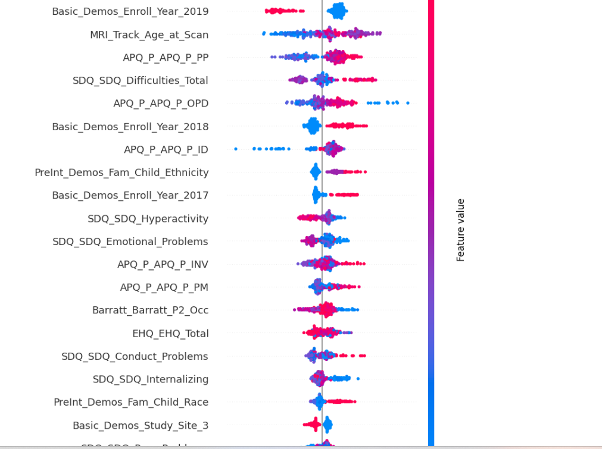
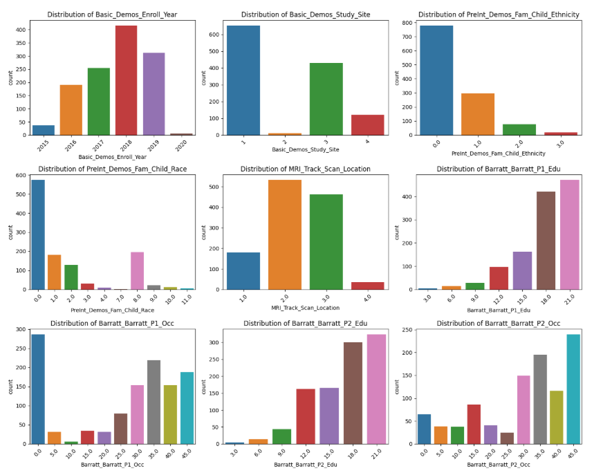
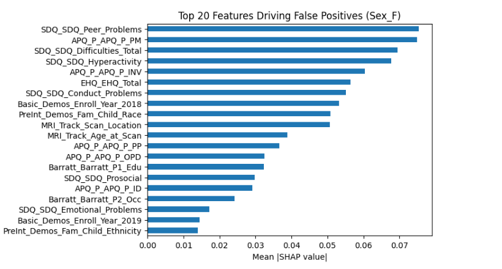

# 🧠 Akili Dada – ML Model for Brain Health | WiDS 2025 Datathon

Welcome to our winning contribution to the [WiDS Datathon 2025](https://www.kaggle.com/competitions/widsdatathon2025), where we tackled a deeply impactful challenge: **predicting female brain health outcomes (ADHD and biological sex)** using anonymized clinical and demographic data.

This repository showcases our **data science pipeline**, from preprocessing to explainability — combining rigor, innovation, and transparency.

---

## 🏁 Challenge Overview

> **Objective**: Build a predictive model that classifies:
>
> * 🧠 Whether a participant has **ADHD**
> * ⚧️ The **biological sex** of the participant
>   Based on anonymized clinical features.

---

## 🔧 Tech Stack & Tools

| Category             | Tools Used                           |
| -------------------- | ------------------------------------ |
| Programming Language | Python                               |
| Modeling             | XGBoost (Multilabel classification)  |
| Evaluation           | Scikit-learn, F1 Score, CV           |
| Preprocessing        | Pandas, NumPy, Label Encoding        |
| Explainability       | SHAP (SHapley Additive exPlanations) |
| Validation           | Multilabel Stratified K-Fold         |
| Platform             | Kaggle Notebooks                     |

---

## 🚀 Our ML Approach

1. **Data Preprocessing**

   * Imputed missing values
   * Label encoded categorical features

2. **Feature Engineering & Selection**

   * Feature importance analysis via **SHAP values**
   * Pruned irrelevant features using domain logic

3. **Modeling Strategy**

   * Handled **class imbalance** with `scale_pos_weight` in XGBoost
   * Hyperparameter tuning via `RandomizedSearchCV` (optimized for macro F1)
   * Custom **threshold tuning** using precision-recall curves

4. **Evaluation & Explainability**

   * Used **5-fold stratified CV** for robust evaluation
   * Visualized SHAP values to interpret feature contributions

---

## 📊 Performance Highlights

| Metric                      | Score    |
| --------------------------- | -------- |
| Macro F1 Score (CV Average) | **0.65** |
| Best Cross-Validation Model | XGBoost  |

🧪 We are continuously iterating on:

* Feature interactions & polynomial features
* Oversampling/undersampling (e.g., SMOTE)
* Ensemble models (e.g., stacking classifiers)

---

## 📌 Notebook Access

🔗 **Explore the full notebook on Kaggle**
[📘 View Full Notebook](https://www.kaggle.com/code/mugwewaithaka/notebook36201769b8)

---

## 🖼 Sample Visualizations

> *These visualizations give insight into how our model reasons and performs. (Replace image URLs with your actual links or filenames.)*

**1. SHAP Summary Plot**

**2. Confusion Matrix**

**3. Feature Selction**

---

## 🌍 Team Akili Dada

A bold step forward by a passionate team committed to using **data science for social impact** — especially in amplifying underserved voices in health.

---

> *“We didn’t just build a model. We told a story about women’s health — through data.”*

